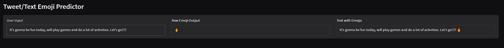

# 🤖 Tweet/Text Emoji Predictor [Live Application](https://huggingface.co/spaces/ashish-001/Emoji-Predictor)

A real-time emoji prediction app that suggests relevant emojis for short text or tweets. Built on a fine-tuned [BERTweet](https://huggingface.co/vinai/bertweet-base) model and deployed with a sleek [Gradio](https://gradio.app) interface.

---

## ✨ Features

* 🚀 Instant emoji prediction as you type
* 🎯 Fine-tuned transformer model for multi-label emoji classification
* 🌐 Simple and responsive Gradio UI
* ⚡️ ONNX version available for fast inference

---

## 🧠 Model

* **Base model**: [`vinai/bertweet-base`](https://huggingface.co/vinai/bertweet-base)
* **Task**: Multi-label emoji prediction
* **Activation**: Sigmoid + class-specific thresholds
* **Output**: One or more emojis based on user input

Supported emojis (49 total):

```
‼ ☺ ♀ ♂ ♥ ✔ ✨ ❤ ➡ 🌟 🎉 🏆 👀 👇 👉 👌 👍 👏 💀 💕 💖 💙 💛 💜 💥 💪 💯 🔥 🗣 😁 😂 😉 😊 😍 😎 😘 😢 😩 😭 😳 🙄 🙌 🙏 🚨 🤔 🤣 🤦 🤷
```

---

## 🖥 Demo Interface



The interface includes:

* `User Input`: A textbox where users type their tweet or text
* `Raw Emoji Output`: The raw emojis predicted by the model
* `Text with Emojis`: Original input appended with predicted emojis


---

## 📦 Installation

Install dependencies with:

```bash
pip install -r requirements.txt
```

---

## 🚀 Run the App

```bash
python app.py
```

This will start a Gradio interface at `http://localhost:7860`.

---

## 🏎 Performance

ONNX version supported for faster inference:

* **Average PyTorch inference time**: 0.079958 sec
* **Average ONNX inference time**: 0.026949 sec
* **ONNX is \~2.97x faster than PyTorch**
* **ONNX model is \~66.30% faster than PyTorch model**

---

